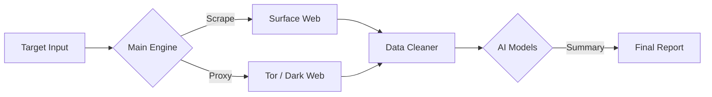

# CIPHER-OSINT

<p align="left">
  
  
  
</p>

> **A fast, concurrent OSINT tool powered by Go and LLMs.**
> Automates data gathering from surface and dark web sources, using AI to summarize findings into actionable reports.

---

### About The Project
**CIPHER-OSINT** is built to solve a common problem in reconnaissance: information overload. Instead of manually sifting through raw logs, this tool uses **Golang** for high-speed scanning and integrates AI (Gemini/GPT/claude) to filter and analyze the data.

It's designed to run efficiently on Linux environments (including Termux), handling everything from scraping to reporting with minimal configuration.

---

### Key Features

| Feature | Details |
| :--- | :--- |
| **AI Analysis** | Uses claude,Gemini or GPT-4 to clean raw data and highlight sensitive information. |
| **Dark Web Support** | Routes requests through Tor (SOCKS5) to scan .onion services safely. |
| **High Concurrency** | Built with Go routines to scan multiple targets simultaneously without lag. |
| **Clean Reporting** | Generates structured Markdown reports instead of messy JSON dumps. |
| **Smart Filtering** | Automatically strips irrelevant metadata to save on API token costs. |

---

### How It Works



---

### Installation

Make sure you have `Go` installed and a working Tor connection (if using dark web features).

```bash
# 1. Clone the repo
git clone https://github.com/cipher-attack/cipher-osint.git

# 2. Install dependencies
cd cipher-osint && go mod tidy

# 3. Setup API Keys
# Create a .env file and add your keys (Gemini, OpenAI, or Anthropic)
# ** Gemini**
echo "GEMINI_API_KEY=your_gemini_key" > .env

# ** ChatGPT (OpenAI)**
echo "OPENAI_API_KEY=your_chatgpt_key" >> .env

# ** Claude (Anthropic)**
echo "ANTHROPIC_API_KEY=your_claude_key" >> .env

# 4. Run
go run .
```

> **Note:** For dark web scanning, ensure Tor is running on port `9050`.

---

### Author

**Biruk Getachew** - *Security Researcher & Developer*

I focus on building efficient security tools that work seamlessly on mobile/ARM architectures. My current work involves integrating LLMs into offensive security workflows to automate the boring parts of recon.

[GitHub](https://github.com/cipher-attack) • [YouTube](https://www.youtube.com/@cipher-attack) • [Telegram](https://t.me/cipher_attacks)

---

### Disclaimer
This tool is for educational purposes and authorized security testing only. Please use responsibly.
