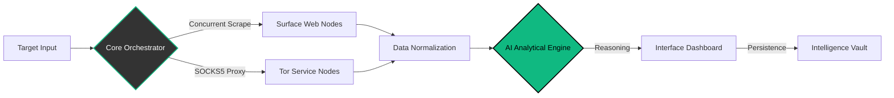

<p align="center">
  
</p>

<p align="center">
  <a href="https://github.com/cipher-attack">
    <svg width="220" height="220" viewBox="0 0 100 100" fill="none" xmlns="http://www.w3.org/2000/svg" style="filter: drop-shadow(0px 0px 15px rgba(16, 185, 129, 0.6));">
      <circle cx="50" cy="50" r="48" stroke="#10b981" stroke-width="0.5" stroke-dasharray="4 2">
        <animateTransform attributeName="transform" type="rotate" from="0 50 50" to="360 50 50" dur="15s" repeatCount="indefinite" />
      </circle>
      <path d="M 75 30 L 35 30 L 15 50 L 35 70 L 75 70" stroke="#10b981" stroke-width="4" stroke-linecap="round" stroke-linejoin="round">
        <animate attributeName="stroke-opacity" values="1;0.4;1" dur="2s" repeatCount="indefinite" />
      </path>
      <circle cx="45" cy="50" r="8" stroke="#ffffff" stroke-width="3">
        <animate attributeName="r" values="7;9;7" dur="1.5s" repeatCount="indefinite" />
      </circle>
      <path d="M 60 50 L 85 50" stroke="#10b981" stroke-width="5" stroke-linecap="round"/>
      <path d="M 70 50 L 70 65" stroke="#10b981" stroke-width="3" stroke-linecap="round"/>
      <path d="M 80 50 L 80 60" stroke="#10b981" stroke-width="3" stroke-linecap="round"/>
      <circle cx="50" cy="50" r="3" fill="#10b981">
        <animate attributeName="r" values="2;5;2" dur="1.2s" repeatCount="indefinite" />
        <animate attributeName="opacity" values="1;0.2;1" dur="1.2s" repeatCount="indefinite" />
      </circle>
    </svg>
  </a>
</p>

<h1 align="center">CIPHER-OSINT</h1>

<p align="center">
  
  
  
  
</p>

<p align="center">
  <b>High-Performance OSINT Discovery & Intelligence Framework</b><br>
  <i>Scalable reconnaissance engine leveraging concurrent Golang architecture and neural synthesis for actionable data extraction.</i>
</p>

---

### Project Overview
**CIPHER-OSINT v7.0** is a sophisticated Open Source Intelligence (OSINT) framework designed for rapid data acquisition and analysis. Built with a focus on high concurrency using **Golang**, it streamlines the process of scanning surface web and dark web targets. By integrating advanced LLMs, it transforms raw technical indicators into structured intelligence reports with minimal manual intervention.

---

### Core Specifications

| Component | Technology | Functional Capability |
| :--- | :--- | :--- |
| **Neural Nexus** | `Gemini / GPT-4` | Automated synthesis of raw data into high-fidelity intelligence. |
| **Privacy Layer** | `Tor SOCKS5` | Stealth routing for .onion service reconnaissance and leak analysis. |
| **Control Plane** | `Go-Fiber` | High-performance dashboard with real-time markdown visualization. |
| **Data Integrity** | `AES-256` | Secure, encrypted archival of intelligence gathering sessions. |
| **Efficiency** | `Preprocessing` | Advanced metadata stripping to optimize AI processing and token cost. |

---

### System Architecture



---

### Deployment Protocol

Environment setup for Linux and Termux nodes.

```bash
# 1. Acquire Framework
git clone [https://github.com/cipher-attack/cipher-osint.git](https://github.com/cipher-attack/cipher-osint.git)

# 2. Resolve Module Dependencies
cd cipher-osint && go mod tidy

# 3. Environment Configuration
# Define your secure API credentials in the .env file
echo "GEMINI_API_KEY=your_secure_key" > .env

# 4. Initialize Core
go run .
```

> **Engineering Note:** Ensure your Tor relay is active on `127.0.0.1:9050` before initiating dark-web modules.

---

### 👤 The Architect

<div align="left">
  
  <h3>Biruk Getachew</h3>
  <p><i>Principal Software Engineer & Cybersecurity Researcher</i></p>
  <p>Specializing in high-performance system architecture, neural interaction models, and sovereign intelligence systems. Engineering tools that bridge the gap between raw data and strategic insight.</p>
  <p>
    <a href="https://www.youtube.com/@cipher-attack"></a>
    <a href="https://github.com/cipher-attack"></a>
    <a href="https://t.me/cipher_attacks"></a>
  </p>
</div>

<br clear="left"/>

---

### Ethical Disclosure
This framework is provided for authorized cybersecurity research and institutional intelligence purposes only. Unauthorized use of this tool for malicious activities is strictly prohibited. The developer assumes no liability for misuse.

<p align="center">
  <br>
  
</p>
