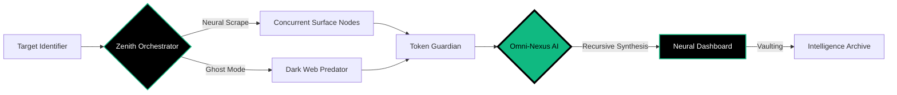

<p align="center">
  
</p>

<p align="center">
  <a href="https://github.com/cipher-attack">
    <svg width="220" height="220" viewBox="0 0 100 100" fill="none" xmlns="http://www.w3.org/2000/svg" style="filter: drop-shadow(0px 0px 15px rgba(16, 185, 129, 0.6));">
      <circle cx="50" cy="50" r="48" stroke="#10b981" stroke-width="0.5" stroke-dasharray="4 2">
        <animateTransform attributeName="transform" type="rotate" from="0 50 50" to="360 50 50" dur="15s" repeatCount="indefinite" />
      </circle>
      <path d="M 75 30 L 35 30 L 15 50 L 35 70 L 75 70" stroke="#10b981" stroke-width="4" stroke-linecap="round" stroke-linejoin="round">
        <animate attributeName="stroke-opacity" values="1;0.4;1" dur="2s" repeatCount="indefinite" />
      </path>
      <circle cx="45" cy="50" r="8" stroke="#ffffff" stroke-width="3">
        <animate attributeName="r" values="7;9;7" dur="1.5s" repeatCount="indefinite" />
      </circle>
      <path d="M 60 50 L 85 50" stroke="#10b981" stroke-width="5" stroke-linecap="round"/>
      <path d="M 70 50 L 70 65" stroke="#10b981" stroke-width="3" stroke-linecap="round"/>
      <path d="M 80 50 L 80 60" stroke="#10b981" stroke-width="3" stroke-linecap="round"/>
      <circle cx="50" cy="50" r="3" fill="#10b981">
        <animate attributeName="r" values="2;5;2" dur="1.2s" repeatCount="indefinite" />
        <animate attributeName="opacity" values="1;0.2;1" dur="1.2s" repeatCount="indefinite" />
      </circle>
    </svg>
  </a>
</p>

<h1 align="center">📡 CIPHER-OSINT [ZENITH OVERLORD]</h1>

<p align="center">
  
  
  
</p>

<p align="center">
  <b>"Deciphering the future before it happens.."</b><br>
  <i>The Industry Standard for AI-Augmented Reconnaissance & Sovereign Intelligence Mapping.</i>
</p>

---

### 🌌 EXECUTIVE SUMMARY
**CIPHER-OSINT v7.0** is a multi-dimensional intelligence orchestration framework. Engineered in high-concurrency **Golang**, it integrates the **Zenith Overlord Engine** to fuse real-time surface scraping with the **Ghost Protocol** (Tor Stealth). By utilizing recursive neural synthesis, it deconstructs technical indicators into high-fidelity actionable intelligence.

---

### 🛠️ TACTICAL SPECIFICATIONS

| COMPONENT | PROTOCOL | CAPABILITY |
| :--- | :--- | :--- |
| **Omni-Neural Nexus** | `Multi-LLM v7` | Adaptive reasoning across Gemini 2.0, GPT-4o, and Claude 3.5. |
| **Dark Web Predator** | `Tor SOCKS5` | Surgical extraction of .onion leak sites and Ransomware nodes. |
| **Zenith Dashboard** | `Go-Fiber 2.0` | Ultra-low latency Neural Interface with real-time Markdown rendering. |
| **Sovereign Vault** | `AES-Vaulting` | Automated archival of intelligence reports in high-fidelity Markdown. |
| **Token Guardian** | `Normalization` | 90% optimization of AI tokens via advanced metadata stripping. |

---

### 🧬 SYSTEM TOPOLOGY (INTELLIGENCE FLOW)



---

### 🚀 DEPLOYMENT PROTOCOL

Optimized for high-performance deployment on Linux and advanced Termux nodes.

```bash
# 1. Initialize the Sovereign Node
git clone https://github.com/cipher-attack/cipher-osint.git

# 2. Synchronize Neural Dependencies
cd cipher-osint && go mod tidy

# 3. Configure Neural Link
echo "GEMINI_API_KEY=your_key_here" > .env

# 4. Initiate Infiltration
go run .
```

> **GHOST-PRO-TIP:** Ensure your **Tor Gateway** is active on `127.0.0.1:9050` before engaging **Predator Mode** for .onion reconnaissance.

---

### 💠 ZENITH INTERFACE CAPABILITIES
- ⚡ **Multi-Model Inversion**: Real-time switching between world-class neural nodes.
- 🌑 **Ghost Protocol**: Toggle active Tor routing for deep-web reconnaissance.
- 📊 **Dynamic Rendering**: Live visualization of intelligence via `Zenith-Interface`.
- 💾 **Neural Export**: Export tactical reports in structured Markdown directly from the UI.

---

### 👤 THE ARCHITECT

<div align="center">
<table style="border-collapse: collapse; border: none;">
  <tr style="border: none;">
    <td align="center" style="border: none; padding: 20px;">
      
    </td>
    <td style="border: none; padding: 20px; text-align: left;">
      <h3 style="margin-top: 0; color: #10b981;">Biruk Getachew (CIPHER)</h3>
      <i style="color: #ffffff;">Principal Architect | Cybersecurity & Neural Systems Expert</i><br><br>
      <p style="max-width: 500px; color: #cbd5e1;">Specializing in Sovereign Intelligence Systems, Neural Interaction, and High-Concurrency Architectural Reconnaissance. Engineering the future of cybersecurity research through high-precision neural logic.</p>
      <div style="margin-top: 15px;">
        <a href="https://www.youtube.com/@cipher-attack"></a>
        <a href="https://github.com/cipher-attack"></a>
        <a href="https://t.me/cipher_attacks"></a>
      </div>
    </td>
  </tr>
</table>
</div>

---

### 🛡️ ETHICAL DISCLOSURE
This framework is released strictly for authorized cybersecurity research, red-teaming, and institutional intelligence gathering. Unauthorized deployment against target systems is strictly prohibited. The developer assumes no liability for tactical misuse.

<p align="center">
  <br>
  <b>Deciphering the future before it happens..</b><br>
  
</p>