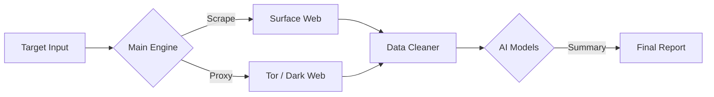

# CIPHER-OSINT

<p align="left">
  
  
  
</p>

> **CIPHER-OSINT v7.0.1 is a high-performance information gathering framework built with Golang. It leverages LLM integration for automated data analysis and utilizes Tor-based routing for secure, anonymous reconnaissance.**

---

### About The Project
**CIPHER-OSINT** is built to solve a common problem in reconnaissance: information overload. Instead of manually sifting through raw logs, this tool uses **Golang** for high-speed scanning and integrates AI (Gemini/GPT/Claude) to filter and analyze the data.

It's designed to run efficiently on Linux environments (including Termux), handling everything from scraping to reporting with minimal configuration.

---

### Key Features

| Feature | Details |
| :--- | :--- |
| **AI Analysis** | Uses Gemini, GPT-4, or Claude to clean raw data and highlight sensitive information. |
| **Dark Web Support** | Routes requests through Tor (SOCKS5) to scan .onion services safely. |
| **High Concurrency** | Built with Go routines to scan multiple targets simultaneously without lag. |
| **Clean Reporting** | Generates structured Markdown reports instead of messy JSON dumps. |
| **Smart Filtering** | Automatically strips irrelevant metadata to save on AI processing costs. |

---

### How It Works



---

### Installation

Make sure you have `Go` installed and a working Tor connection (if using dark web features).

```bash
# 1. Clone the repo
git clone [https://github.com/cipher-attack/cipher-osint.git](https://github.com/cipher-attack/cipher-osint.git)

# 2. Install dependencies
cd cipher-osint && go mod tidy

# 3. Setup API Keys
echo "GEMINI_API_KEY=your_key_here" > .env
echo "OPENAI_API_KEY=your_key_here" >> .env
echo "ANTHROPIC_API_KEY=your_key_here" >> .env

# 4. Run the tool
go run .
```

---

### 👤 THE ARCHITECT

<div align="left">
  
  <h3>Biruk Getachew (CIPHER)</h3>
  <p><i>Offensive Security Researcher & AI Integrator</i></p>
  <p>I am a 12th-grade student passionate about Offensive Security and AI. I manage my entire development and auditing workflow directly from mobile interfaces, focusing on the integration of Large Language Models (LLMs) to automate vulnerability discovery and high-precision reconnaissance.</p>
  <p>
    <a href="https://github.com/cipher-attack">GitHub</a> • 
    <a href="https://www.youtube.com/@cipher-attack">YouTube</a> • 
    <a href="https://t.me/cipher_attacks">Telegram</a>
  </p>
</div>

<br clear="left"/>

---

### Disclaimer
This tool is for educational purposes and authorized security testing only. Please use responsibly.
