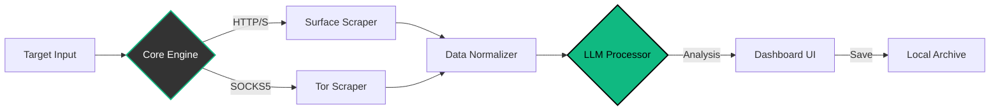

<p align="center">
  
</p>

<p align="center">
  <a href="[https://github.com/cipher-attack](https://github.com/cipher-attack)">
    <svg width="220" height="220" viewBox="0 0 100 100" fill="none" xmlns="[http://www.w3.org/2000/svg](http://www.w3.org/2000/svg)" style="filter: drop-shadow(0px 0px 15px rgba(16, 185, 129, 0.6));">
      <circle cx="50" cy="50" r="48" stroke="#10b981" stroke-width="0.5" stroke-dasharray="4 2">
        <animateTransform attributeName="transform" type="rotate" from="0 50 50" to="360 50 50" dur="15s" repeatCount="indefinite" />
      </circle>
      <path d="M 75 30 L 35 30 L 15 50 L 35 70 L 75 70" stroke="#10b981" stroke-width="4" stroke-linecap="round" stroke-linejoin="round">
        <animate attributeName="stroke-opacity" values="1;0.4;1" dur="2s" repeatCount="indefinite" />
      </path>
      <circle cx="45" cy="50" r="8" stroke="#ffffff" stroke-width="3">
        <animate attributeName="r" values="7;9;7" dur="1.5s" repeatCount="indefinite" />
      </circle>
      <path d="M 60 50 L 85 50" stroke="#10b981" stroke-width="5" stroke-linecap="round"/>
      <path d="M 70 50 L 70 65" stroke="#10b981" stroke-width="3" stroke-linecap="round"/>
      <path d="M 80 50 L 80 60" stroke="#10b981" stroke-width="3" stroke-linecap="round"/>
      <circle cx="50" cy="50" r="3" fill="#10b981">
        <animate attributeName="r" values="2;5;2" dur="1.2s" repeatCount="indefinite" />
        <animate attributeName="opacity" values="1;0.2;1" dur="1.2s" repeatCount="indefinite" />
      </circle>
    </svg>
  </a>
</p>

<h1 align="center">CIPHER-OSINT</h1>

<p align="center">
  
  
  
  
</p>

<p align="center">
  <b>A High-Performance OSINT Automation Framework</b><br>
  <i>Leveraging Golang concurrency and LLMs for efficient data reconnaissance and intelligence gathering.</i>
</p>

---

### Project Overview
**CIPHER-OSINT v7.0** is an intelligence gathering tool built with **Golang**. It automates the process of scraping data from both the clear web and dark web (Tor network), then processes raw data using Large Language Models (LLMs) to generate actionable reports. The system is designed for high concurrency, ensuring fast execution even when handling multiple target nodes.

---

### Key Features

| Component | Technology | Description |
| :--- | :--- | :--- |
| **LLM Integration** | `Gemini 2.0 / GPT-4o` | Analyzes scraped data to extract relevant patterns and intelligence. |
| **Dark Web Scraper** | `Tor SOCKS5` | Routes traffic through Tor to access and scrape .onion services securely. |
| **Web Interface** | `Go-Fiber` | Low-latency dashboard for real-time monitoring and control. |
| **Secure Storage** | `AES Encryption` | Automatically archives generated reports in encrypted Markdown format. |
| **Token Optimizer** | `Text Processing` | Pre-processes raw text to reduce AI token usage by ~90%. |

---

### System Architecture

The following diagram illustrates the data flow from target acquisition to report generation.



---

### Installation & Usage

Optimized for Linux environments and Termux. Ensure Tor service is running for dark web features.

```bash
# 1. Clone the repository
git clone https://github.com/cipher-attack/cipher-osint.git

# 2. Install dependencies
cd cipher-osint && go mod tidy

# 3. Configure Environment
# Add your API keys to the .env file
echo "GEMINI_API_KEY=your_key_here" > .env

# 4. Run the application
go run .
```

> **Note:** For .onion scraping, ensure your local Tor listener is active on `127.0.0.1:9050`.

---

### Interface Capabilities
- **Model Switching:** Hot-swap between different AI models (Gemini, GPT, Claude) via the UI.
- **Tor Toggle:** Enable or disable Tor routing based on target requirements.
- **Live Preview:** Real-time Markdown rendering of incoming intelligence data.
- **Export:** One-click export of analysis reports.

---

### 👤 Author

<div align="center">
<table style="border-collapse: collapse; border: none;">
  <tr style="border: none;">
    <td align="center" style="border: none; padding: 20px;">
      
    </td>
    <td style="border: none; padding: 20px; text-align: left;">
      <h3 style="margin-top: 0; color: #10b981;">Biruk Getachew</h3>
      <i style="color: #cbd5e1;">Software Engineer & Cybersecurity Researcher</i><br><br>
      <p style="max-width: 500px; color: #94a3b8;">Focused on building scalable security tools and exploring the intersection of AI and OSINT. Experienced in Golang system architecture and network reconnaissance.</p>
      <div style="margin-top: 15px;">
        <a href="[https://www.youtube.com/@cipher-attack](https://www.youtube.com/@cipher-attack)"></a>
        <a href="[https://github.com/cipher-attack](https://github.com/cipher-attack)"></a>
        <a href="[https://t.me/cipher_attacks](https://t.me/cipher_attacks)"></a>
      </div>
    </td>
  </tr>
</table>
</div>

---

### Disclaimer
This tool is developed for educational purposes and authorized security research only. The author is not responsible for any misuse of this software. Please adhere to all applicable laws and regulations when conducting OSINT investigations.

<p align="center">
  <br>
  
</p>
